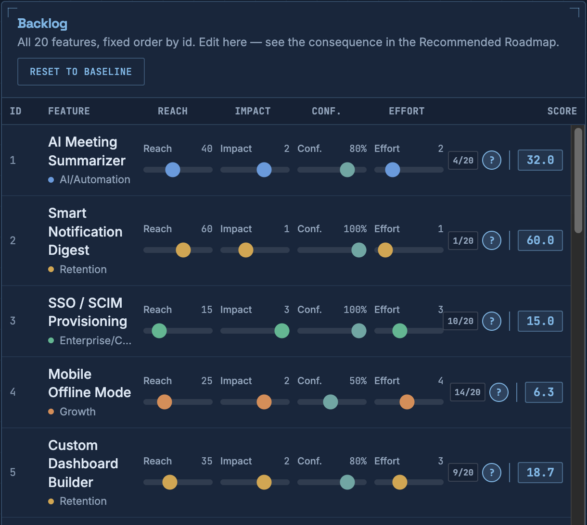
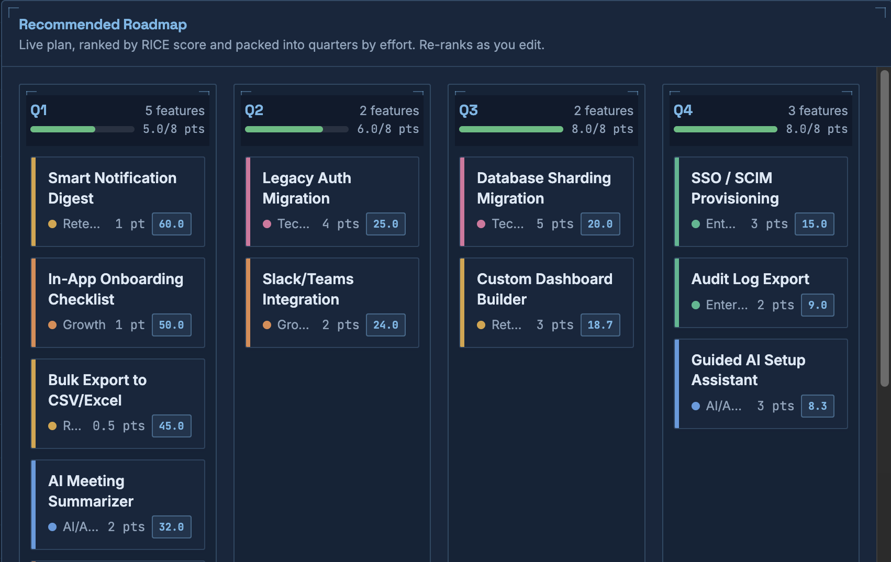

# Roadmap Tradeoff Visualizer

An interactive tool for exploring how prioritization frameworks actually work —
adjust a feature's reach, impact, confidence, or effort and watch the quarterly
roadmap re-rank in real time.

  

  
  

## Why I built this

Most roadmap prioritization happens in a spreadsheet, and the reasoning behind
"why this beat that" tends to live in someone's head rather than anywhere visible.
This tool makes the tradeoffs explicit and interactive — instead of reading a case
study, you can move the sliders yourself and see how a small confidence change or
an effort estimate reshuffles an entire quarter.

The backlog (20 features across a fictional product called Nimbus) and scoring
data are synthetic, built to stress-test close calls and real tradeoffs rather
than obvious wins.

## How it works

- **Backlog panel**: the full feature list, in fixed order, with editable sliders
  for reach, impact, confidence, and effort per feature. This is where you make edits.
- **Recommended Roadmap panel**: the same features, ranked live by RICE score and
  packed into quarters by effort capacity. This is where you see the consequence.
- **Why this ranking?**: click the icon next to any feature's score to see the
  reasoning behind its placement, compared to its immediate neighbors in the
  ranking. Since this reasoning describes the original baseline scoring, it's
  automatically flagged as stale if you've edited that feature's values — use
  "Reset to Baseline" to restore it.
- **Mobile**: a tabbed Backlog/Roadmap view keeps the edit-and-see-the-result
  loop intact on narrow screens, instead of losing context in a long scroll.

## Stack

React + Vite, Tailwind CSS, deployed on Vercel. Built end-to-end with Claude Code.

## Status

**Phase 1 & 2 complete**: static backlog, live RICE scoring, interactive
quarterly roadmap, and per-feature tradeoff explanations with baseline
divergence tracking — all client-side, no backend.

**Possible next steps**: framework comparison (RICE vs. WSJF toggle), a
shareable/exportable view of a customized roadmap.

## Running locally

\`\`\`bash
npm install
npm run dev
\`\`\`
